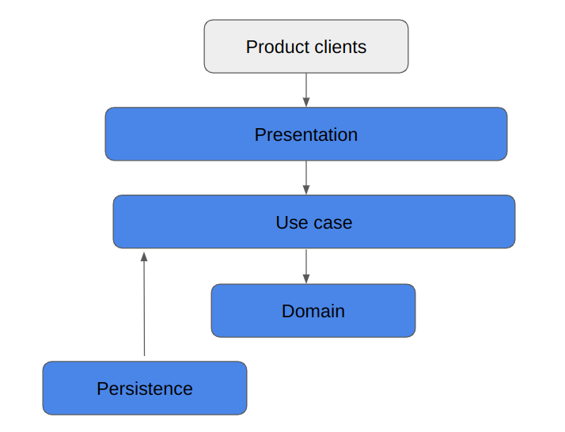

# Readme

## Estrategia de Monitoreo

Este proyecto utiliza la libreria de [Micrometer](https://micrometer.io/) la cual ofrece conexiones 
con los siguientes proveedores:
* Datadog
* Dynatrace
* Prometheus
* Entre otros...

## Patrones utilizados

El proyecto esta basado en la arquitectura limpia propuesta por Robert C. Martin con las siguientes capas
de afuera hacia adentro
* Frameworks and Drivers
* Interface Adapters
* Application Business (Use case)
* Enterprise Business (domain)

Entre los patrones de diseño utilizados están:
* Adapters
* Factory
* Builders

## Arquitectura

## Cómo ejecutar el proyecto
Este proyecto esta basado en spring-boot para su ejecución
`mvn spring-boot:run`

## Postman
Se incluyen las diferentes peticiones en la carpeta de "postman" con los ejemplos de las peticiones
